# balanceBot-v0

## **Introduction**
Over the past few years I have found myself growing increasingly nerdy in all matters engineering related (and trains too for that matter), and it so happens that this interest has had a direct correlation with my desire to build a cool engineering project. I have been fascinated by the [inverted pendulumn problem](https://en.wikipedia.org/wiki/Inverted_pendulum) since my University days, and with some free, unemployed time on my hands I decided to build something influenced by it- the self balancing robot.

### **Goals**
The goal for this project was to build a self-balancing robot from the ground up. No kits, no libraries, no pre-made parts (lets talk about breakout boards later). This was a challenge to approach every aspect of the robot from ground zero with my own engineering decisions and mistakes (so, so many mistakes). There will be stretch goals for subsequent versions of this project but these will be discussed further below under their specific design category. 

### **Parts List**

A quick summary of the parts used. Consumables such as wires and screws are not listed.

| Part Name | Quantity|
|-|-|
|STM32F401RE Nucleo Board | 1 |
|A4988 Stepper Driver   | 2|
|SEN0142 MPU6050 Board | 1 |
|SM-42HB34F08AB 12V/1.33A Stepper Motor| 2|
|1998 5MM SHAFT M3 MNTG Hub| 2|

### **Results**
You don't need to scroll all the way down, here is a gif of the robot doing a happy little balancing dance:


From stress testing it can balance for over five minutes. This is the cutoff where the motors are too hot and the frame begins to melt. It has good setpoint tracking with only minor oscillation and good disturbance rejection (not demonstrated in gif).

### **Next Steps**

Some big future goals I have for the project:
- Integrate all components onto a PCB
- Add bluetooth steering
- Refine the system control (cascade or LRQ)

Stay tuned!

## **Design**

## Mechanical

My approach to the frame design was straightforward: I wanted the robot to be around 20-30cm tall and it needed to be wide enough to accomodate my protoboards. As I have been getting into 3D printing, I chose to design it all in Fusion360. All the following parts were designed in CAD and the stl's are in on github. I won't include the 3D files because I'm pretty sure my file structure/ogranization in them is atrocious.

### **Frame**

I wanted the frame to be modular so that I could print and test the fit of pieces without wasting time or PLA. To accomodate this I added slots on the frame sides so that the middle brackets could slide in. The middle brakets are further secured by pressing a square nut into the holes in each corner before seating them, then screwing them into place. All hardware used to secure the brackets is m3 as its what I had easiest access to.

The middle brackets have slots down the middle for modular mounting of PCBs later. The side brackets have flames down the middle for speed.

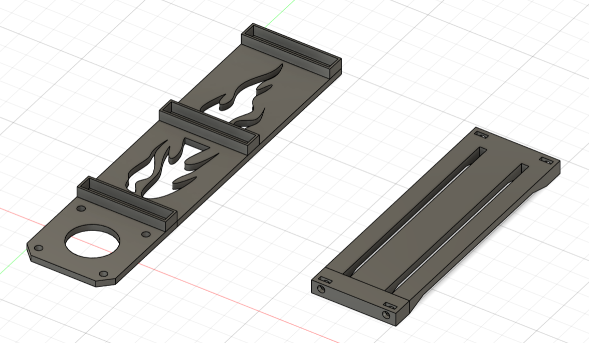

*Frame Design*

### **Wheels**

Not too much design aspect for the wheels, just had to make sure they fit the aluminium mounting hubs I ordered. 

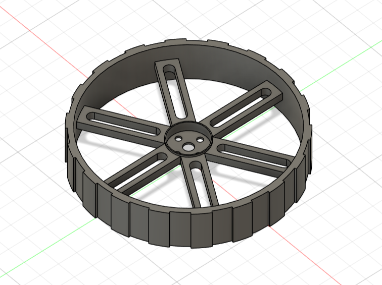

*Wheel Design*

As I was making custom wheels, I needed custom tires to fit them. After researching many methods, the best and most cost effective I found was to make them using hardware store silicone (mono silicone sealant) mixed with cornstarch. Through some messy experimentation, I found a good ratio of silicone to cornstartch was 10:1 and that about 100g silicone + 10g cornstarch was enough to fill my tire molds and had about a 24 hour curing time. The tire mold went through two iterations of design in order to make it easier to remove the tires wihout ripping them. Not many photos here as it was messy.

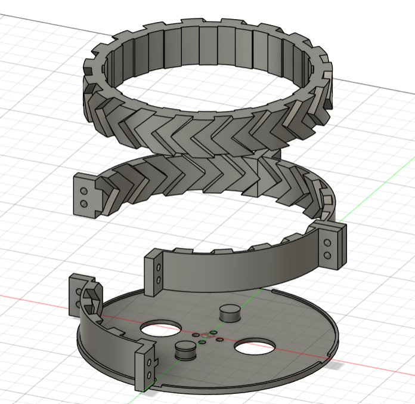

*Tire/Mold Design*

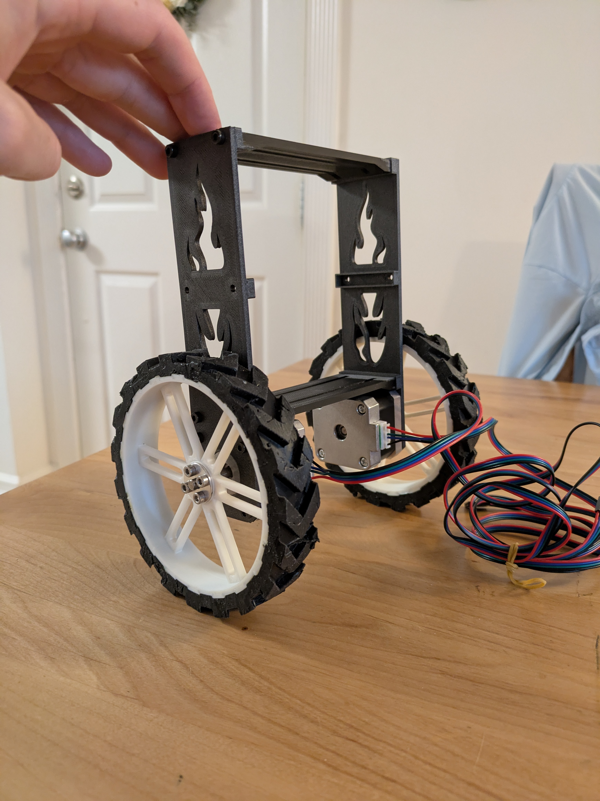

*Assembled Frame*

### **Improvements**

- Frame needs to be printed in a stronger material. The PLA begins to melt after running the motors for more than 5 minutes continuously
- Tires could be redesigned to have less aggresive tread as it would make them easier to remove from the mold. Holy hell taking them out was stressful 
- If I had access to a different material to print the tires with I would 3D print them directly to save hassle
- The mounting bracket system will likely be redesigned for V1 as I get custom PCBs, but it is modular and works well in the meantime

## Electrical

Here is where we talk about using eval boards for components like the A4988 drivers or MPU6050 inertia measurement unit. For V0 of this project, I thought it was more important to get an inital prototype actually working rather then spending months in the weeds doing design work that has already been completed. I have plans to make a microcontroller integrated PCB for the robot, so integrating these other chips would fall within this stretch goal. Good is better than perfect if it means you get stuff done.

### **Part Selection**
#### MicroController

I chose to use STM32 as I wanted to work within an industry accepted environment (sorry arduino). This also meant I got to practice and improve my bare metal programming skills and dry out my eyes reading datasheets. It was also a goal of mine to write libraries for all my components from scratch (except for HAL drivers as I've done this before) and this platform supported this goal by having nothing pre-existing readily available.

#### Motors

NEMA17 stepper motors were chosen due to the ability to directly control their position by commanding steps. To size them properly, I looked for a set that had sufficient torque rating that was over double what I calculated for my robot. I also looked for a higher voltage motor so I could power both the motor and the electronics from one power source.

#### Driver

From research the A4988 is a common motor driver that can support up to ~1.2A of current which is very close to the max rated current of ~1.33A of my motors. 

#### Inertia Measurement Unit

Again, from research the MPU6050 is a common IMU to use. 6DOF was plenty for only neededing to detect pitch and y angle.

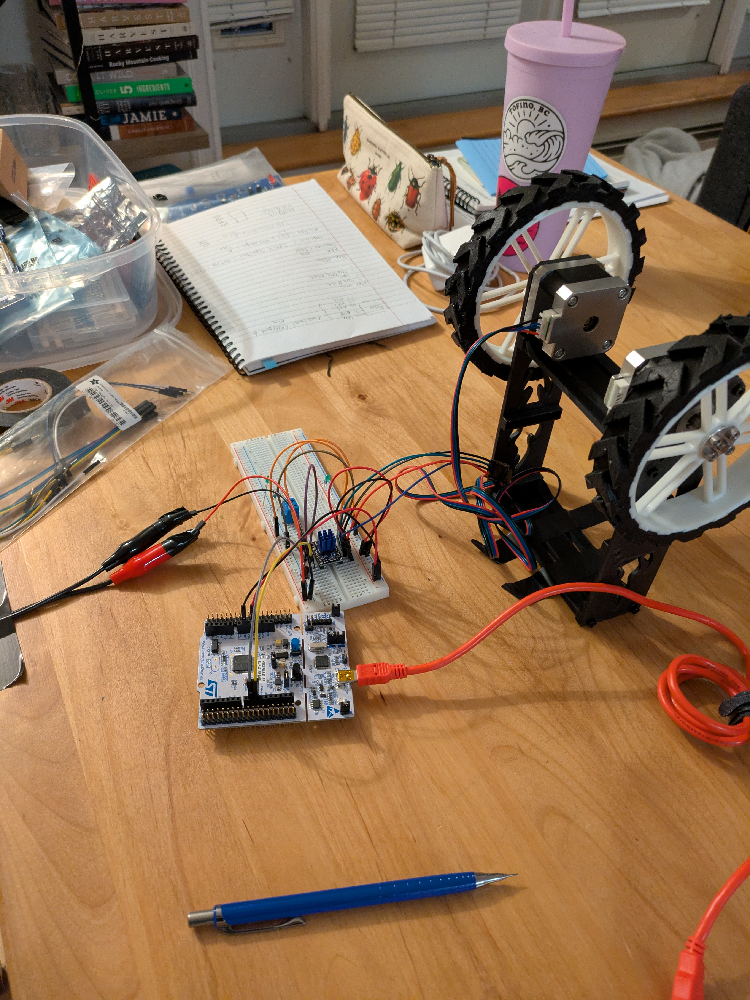

*Electronics Breadboarding*

### **Power Distribution**

A little power distribution circuit designed around the LM7805. The LM7805 can regulate up to 30V into 5V which can power the STM32 and peripherals. This lets me run everything from my 12V wall source or a single 4S Lipo battery. LED's are hugely useful for visual feedback that your system is working as intended. This ciruict was soldered onto protoboard along with breakout pins for the A4988 and MPU6050 boards. As mentioned in this sections header, V1 will hopefully incorporate all the components onto a dedicated PCB along with multiple power input methods. Note I only used resistors close to the values shown, just not remembering true values at time of writing this.

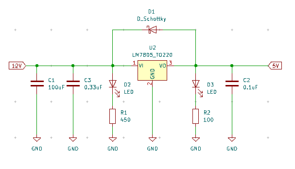

*Power Distribution using LM7805*

### **Improvements**
- Integrate all components into a single PCB (V1)
- Add multiple methods for power connection and reverse voltage protection
- I haven't actually caluclated a power draw for this sytem yet, so am guessing at the mAh of the batteries I need to order

## Software

Prepare for a long section with diagrams. Writing these libraries and troubleshooting code took propably twice to three times as long as the rest of the project put together. This was probably the most valuable section of the project (so far) for me as it really helped improve my bare metal knowledge. For running a real time control system you need to have around 100-200 Hz loop frequency (5-10 ms loop times).

### **MPU6050 Library**

The MPU6050 communicates with the STM32 over I2C. Sending/reading data from the device is generally easy, using HAL_Read you can read directly from the MPU6050 registers. 

#### Accelerometer and Gryo Data

Straight forward section, just read from registers specified on the MPU6050 datasheet. Simple as.

#### Accelerometer and Gryo Angles

X/Y/Z or Pitch/Yaw/Roll angles can be calculated from your accelerometer and gyro readings. Accelerometer angle is based on trigonometry between the acceleration axises and the gyro angle is based on time elapsed between measurements. Implementations can be found in source code. Rule of thumb for these readings is that angles from your accelerometer will be noisy and angle from you gyro will drift over time. 

#### Kalman Filter Angle

To overcome the noise and drift issues in direct angle calculation, we use the kalman filter. This filter lets us predict the state of a system based on known readings and our estimation of error from both our calculation of the system state and our measurement of the system state. Using a kalman filter is preferable here as values can converge more quickly than averaging over time allowing us to use the filtered angle immediately. As shown below, it is quite amazing how well this works- notice how we have a noisy accelerometer signal and gyro drift and how these are filtered into a smooth signal.

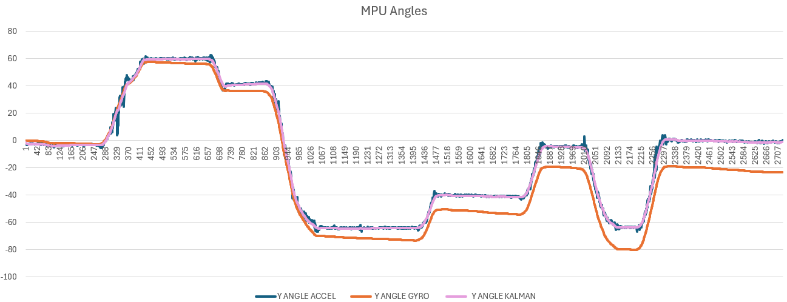

*MPU angle comparison*

### **PID Library**

Controls is awesome and if you don't love controls you should because it's awesome. The self balancing robot is technically a non-linear system and thus is a good candidate for a linear quadratic regulator (LQR) which I might implement in a later version. However, PID is also a very reliable method of control and with proper tuning can give excellent results even for non-linear systems. PID is also much simpler to implement in code and I had prior expereince doing it. 

#### PID Updating

This method just updates a PID loop based off its initialzed set point, current value, loop time, and whether we are including derivative filtering. As the block diagram below shows, the code functions as a regular PID loop. Something that is not always common in these systems is the low-pass derivative filtering to smooth noise. From testing, the derivative noise was badly amplified that the robot would shake uncontrollably without any sort of filter on this error. 

Some notes for tuning these gains:

- P: Tune until the robot can catch itself but begins to oscillate back and forth
- D: After P, tune until oscillations are removed and minimized
- I: After D, tune if the robot is drifting in a particular direction. Only tune slightly and if needed.

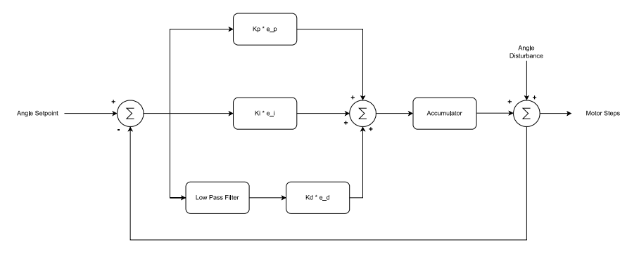

*PID Control with Low Pass Filtering*

#### Low Pass Filtering

The low pass filter is used to smooth an output based on previous input data. It has an alpha scaling factor from 0.1 (very smooth) to 1 (no smoothing). Some examples of PID logs with and without smoothing are shown below for dramatic impact.

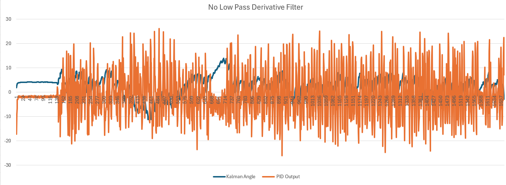

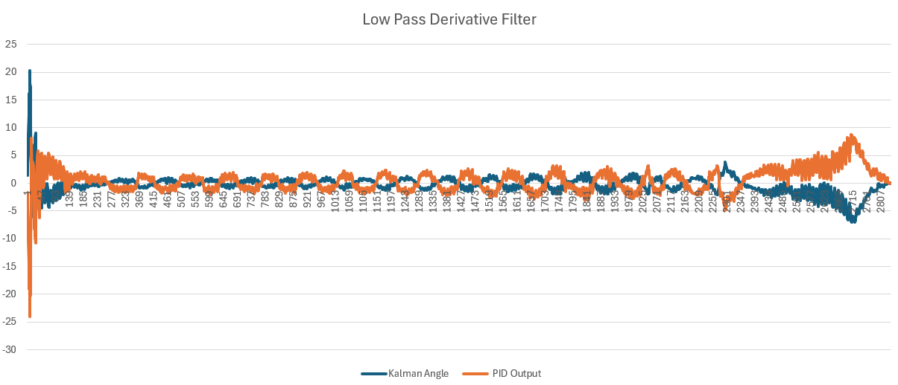

*Difference between without and with low pass derivative filtering*


### **A4988 Library**

I wrote an A4988 C library for the STM32F401RE and this helped me get a really good basis of state-based programming, timer setup, and interrupt handling. This was the final piece after implementing the previous two libraries and I thought it would keep going quickly! I was devistatingly wrong. Writing non-blocking motor control code was incredibly tedious, and I spent a lot of time troubleshooting and reading through some other peoples work online. Specifically the following mentions:

[Laurb9's Arduino Cpp Code](https://github.com/laurb9/StepperDriver)

[ErniW's Cpp Code](https://github.com/ErniW/Stepper-motor-bare-metal-STM32)

[Patrick's C Code](https://gitlab.com/rickpat/stm32_a4988)

Now for A4988 operating theory. The A4988 sends motor step when it sees a rising edge on its STEP pin and then needs a 1us settling time before the next pulse. This means the driver can be driven by PWM from the STM32 timer channels or through timer based GPIO triggers. Each of the following different states "modes" controls the PWM frequency in a slightly different way.

For state-based design, I may have gone overboard. Without a pre-planned state diagram, I found myself getting more and more convoluted as my work progressed. The resulting states and their related substates are in the diagram below and I will talk breifly about them in the following sections.

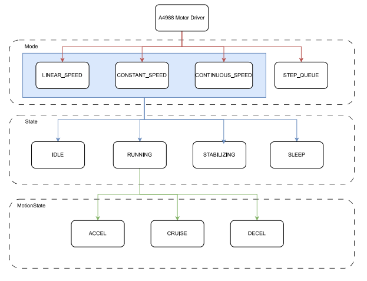

*Breakdown of A4988 states and substates*

#### Constant/Linear Speed Modes

This was my first attempt at motor control and was based on what I learned from other motor source code. We set the timer to PWM and then vary the timer length (ARR) to change the motor speed. Every time the motor meets the control capture value it creates an interrupt in which we update parameters such as: position, next cycle speed, steps remaining. While this works really well for time invariant pre-planned moves, it lags in real time systems and was not even remotely close to balancing the bot.

Constant Mode: Send a set number of steps to move and the motor will run at the preset RPM for all steps

Linear Mode: This gives the motor a trapezoidal or triangular speed profile so that it accelerates, cruises, then decelerates over the number of steps you provide it. 

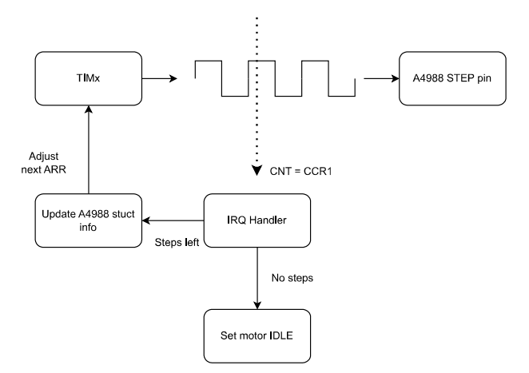

*Constant/Linear speed diagram*

#### Continuous Speed Mode

The second attempt at motor control was a continuous speed mode, where the motors are constantly running and you just update the RPM. In theory this should work and I probably could've gotten there with it but I ran into MAJOR timer issues. Firstly, I had a timer issue where going from a high -> low rpm would cause the motor to freeze due to the timer ARR not updating and then another CCR event not triggering. I solved this by forcing an auto reload and CNT to 0 so that the timers would function properly for PWM.

This fix caused my second issue in which by forcing a reload and the CNT to 0 I would cut off the PWM cycle of some PWM pulses if my main loop was executing too fast. This was an issue as the main loop needed to run at speeds that prohibited this style of motor control from working at RPM's less than around 30 (depending on microstepping levels). The structure for this looks similar to the diagram in constant/linear. All in all, I probably worked on this mode for 30-40 hours before abandoning it. It still works for continous speed, just not for high update rate applications.

Here are the timing tables I made to diagnose the second issue. These are also useful for if you want to use this mode for some reason and need to know its limits.

*TIMING VALUES FOR REALISTIC RPMS FOR MICROSTEP LEVELS TABLE*
|MS SCALE| MIN ARR 16 Bit [us]| MAX ARR 16 Bit [us]| MIN ARR 32 Bit [us] | MAX ARR 32 Bit [us]
|- |- | -| -| -|
| 1 | 1500 | 60000 | 1500 | 300000 |
| 1/2 | 750 | 50000 | 750 | 150000 |
| 1/4 | 375 | 37500 | 375 | 75000 |
| 1/8 | 187 | 37500 | 187 | 37500 |
| 1/16 | 93 | 18750|  93 | 18750 |

#### Step Queue Mode

The holy grail of motor control. After a lot more research and pondering I started step queue method. By running a timer at a constant frequency (10KHz) and using the IRQ handler to choose when to toggle the output pin (i.e. use GPIO instead of TIMx Channels) we can control the amount of steps we are taking almost in real time. The kicker here is that the IRQ handler needs to be fast:

 ```"Interrupts shall be quick and simple"```

 When we mean fast, we mean on the order of a few us, as there is only 100us inbetween interrupt calls. For this, I stripped down my IRQ handler to the essentials and used some atomic functions and direct register writes to make the process faster.

 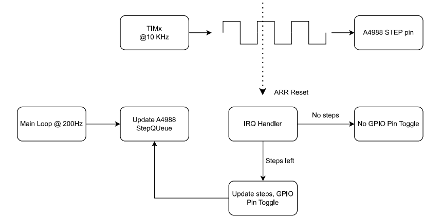

*Step Queue diagram*

FINALLY success! As a final safety precaution, I created another table to limit the number of steps fed into the step queue for each iteration of the main loop, effectively capping the maximum RPM. The below table shows the max steps allowed to queue for different max RPMs at different main loop speeds [Hz]. This is showed for sixteenth microstepping and the values vary for different resolutions of full steps.

 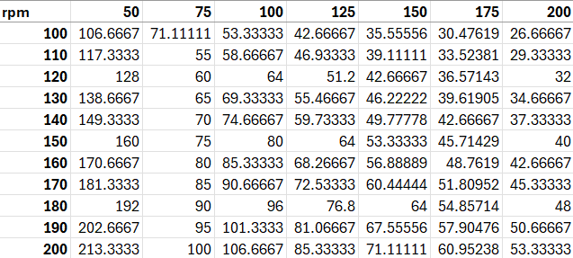

*Step Queue Max RPM for 1/16 Microstepping*

### **Improvements**
- I'm just going to spend a month in a hole refactoring my code and bug testing


 

*Cozy workstation shot if you made it this far*
